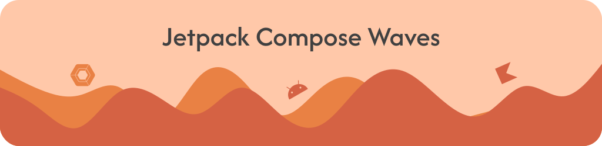
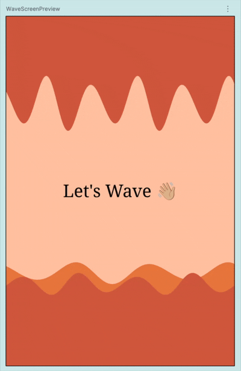

<p align="start">
  
</p>

<p align="left">
  
  
  
  
</p>

A lightweight, customizable, animated wavy background composable for Jetpack Compose. Perfect for headers, footers, sections, onboarding screens, and aesthetic UI elements.

## 🎥 Live Preview




# 🌊 Features

- ✅ Crest-touching waves (top or bottom)
- ✅ Smooth infinite horizontal wave motion
- ✅ Optional breathing vertical animation
- ✅ Auto-scales for any height (even **1.dp**)
- ✅ Zero clipping / zero cut-outs
- ✅ Easy presets (`WaveStyle`)
- ✅ Highly customizable
- ✅ No dependencies
- ✅ MIT license


# 🚀 Quick Start

Just copy these files into your project:

```
waves/
└── com/jaikeerthick/waves/
    ├── WavyBackground.kt
    ├── WaveDirection.kt
    ├── WaveStyle.kt
    └── WavePreviews.kt
```

No setup required. No Gradle configuration. No library installation.

# 🪄 Usage

### 1. Basic Example

```kotlin
WavyBackground(
    modifier = Modifier
        .fillMaxWidth()
        .height(180.dp),
    color = Color(0xFF4FC3F7)
)
```


### 2. Wave at Top ⬆

```kotlin
WavyBackground(
    modifier = Modifier
        .fillMaxWidth()
        .height(150.dp),
    waveDirection = WaveDirection.Top,
    color = Color(0xFF80DEEA)
)
```


### 3. Wave at Bottom ⬇

```kotlin
WavyBackground(
    modifier = Modifier
        .fillMaxWidth()
        .height(150.dp),
    waveDirection = WaveDirection.Bottom,
    color = Color(0xFF26C6DA)
)
```


## Wave Style Presets

```kotlin
WavyBackground(
    style = WaveStyle.Calm
)
```

## Available Presets

| Style     | Description                  |
| --------- | ---------------------------- |
| Calm      | Slow, soft, minimal movement |
| Gentle    | Balanced, default preset     |
| Energetic | Fast-moving, deeper waves    |


## ⚙ Advanced Customization

```kotlin
WavyBackground(
    waveCount = 7,
    waveAmplitude = 24.dp,
    waveSpeed = 900f,
    verticalOscillationSpeed = 1400f,
    reverseDirection = true,
    animateWaveShape = true
)
```

## Parameters

| Name                       | Description                              |
| -------------------------- | ---------------------------------------- |
| `waveDirection`            | Top or Bottom                            |
| `waveCount`                | Number of waves across the width         |
| `waveAmplitude`            | Height of the wave crests/troughs        |
| `waveSpeed`                | Duration (ms) for a full horizontal loop |
| `verticalOscillationSpeed` | Speed of breathing animation             |
| `reverseDirection`         | Reverse horizontal motion                |
| `animateWaveShape`         | Enable/disable breathing effect          |


## 🧪 Previews

To preview waves in Android Studio:

```kotlin
@Preview
@Composable
fun PreviewWaves() {
    WavyBackground(
        modifier = Modifier
            .fillMaxWidth()
            .height(180.dp),
        style = WaveStyle.Gentle
    )
}
```

## 🧩 How It Works

* Uses a **Canvas** & trigonometric Bézier-like curve drawing
* Ensures the **crest touches the edge** cleanly
* Auto-scales based on the composable height
* Smooth per-frame animation using `withFrameMillis`
* Fully optimized — no allocations per frame


## ❤️ Contribute

Pull requests are welcome!
Here are great ways to contribute:

* New wave presets
* Additional wave shapes (multi-layer waves?)
* Theming support
* Performance improvements
* Documentation improvements


## ⭐ Support the Project

If this helped you, consider giving the repo a **star** ⭐ — it motivates continued updates!


## 📄 License
This project is licensed under the terms of the **MIT License**.  
See the full license here: [LICENSE](./LICENSE)
```
MIT License
Copyright (c) 2025
```
